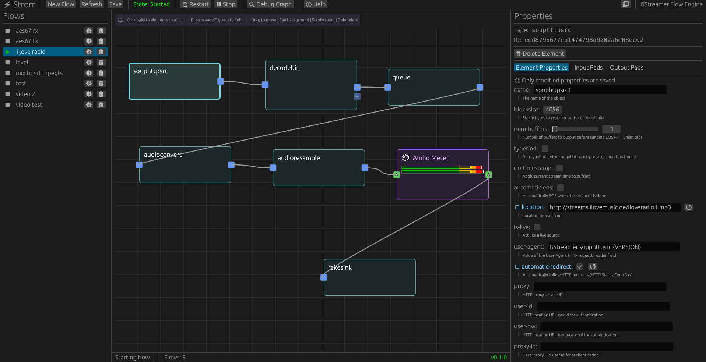

# Strom - GStreamer Flow Engine

**Strom** ("Ström" - Swedish for "stream") is a visual, web-based interface for creating and managing GStreamer media pipelines. Design complex media flows without writing code.

---
<div align="center">

## Quick Demo: Open Source Cloud

Run this service in the cloud with a single click.

[](https://app.osaas.io/browse/eyevinn-strom)

</div>

---


*Visual pipeline editor showing a simple test flow*

## Features

- **Visual Pipeline Editor** - Node-based graph editor in your browser
- **Real-time Control** - Start, stop, and monitor pipelines via REST API or WebSocket
- **Element Discovery** - Browse and configure any installed GStreamer element
- **Reusable Blocks** - Create custom components from element groups (e.g., AES67 receiver)
- **gst-launch Import/Export** - Import existing `gst-launch-1.0` commands or export flows to gst-launch syntax
- **SAP/AES67 Discovery** - Browse and monitor network audio streams via SAP announcements
- **PTP Clock Monitoring** - View PTP synchronization status and statistics per domain
- **Media File Browser** - Manage media files for playlist playback
- **Links Page** - Quick access to WHEP player pages and stream URLs
- **System Monitoring** - Real-time CPU, memory, and GPU usage graphs in the topbar
- **Authentication** - Secure with session login or API keys (optional)
- **Auto-restart** - Pipelines survive server restarts
- **Native or Web** - Run as desktop app or web service
- **MCP Integration** - Control pipelines with AI assistants (Claude, etc.)
- **CI/CD** - Automated testing, building, and releases for Linux, Windows, macOS, and ARM64
- **HTML Rendering** - Render web pages as video sources using CEF (via `strom-full` Docker image)

### Advanced Capabilities

- **Dynamic Pad Linking** - Automatic handling of runtime-created pads (decodebin, demuxers)
- **Automatic Tee Insertion** - Fan-out outputs without manual configuration
- **Pad Properties** - Configure per-pad properties (e.g., volume/mute on audiomixer inputs)
- **Debug Graphs** - Generate SVG visualizations of running pipelines
- **WebSocket/SSE** - Real-time state updates and pipeline events

## Quick Start

### Option 1: One-liner Install (Recommended)

```bash
curl -sSL https://raw.githubusercontent.com/Eyevinn/strom/main/install.sh | bash
```

The interactive installer detects your OS, downloads the latest release, and installs GStreamer dependencies.

For CI/CD or scripted installs, use environment variables:

```bash
curl -sSL https://raw.githubusercontent.com/Eyevinn/strom/main/install.sh | AUTO_INSTALL=true GSTREAMER_INSTALL_TYPE=minimal bash
```

Available options: `AUTO_INSTALL`, `GSTREAMER_INSTALL_TYPE` (full/minimal), `SKIP_GSTREAMER`, `SKIP_GRAPHVIZ`, `INSTALL_DIR`, `VERSION`.

After installation, run `strom` and open `http://localhost:8080` in your browser.

### Option 2: Using Pre-built Binaries

Download the latest release for your platform from [GitHub Releases](https://github.com/Eyevinn/strom/releases):

```bash
# Linux
wget https://github.com/Eyevinn/strom/releases/latest/download/strom-v*-linux-x86_64
chmod +x strom-v*-linux-x86_64
./strom-v*-linux-x86_64

# macOS
# Download and run the macOS binary
```

**Windows:** Download the MSI installer (`strom-*-windows-x86_64.msi`) for a one-click installation that bundles GStreamer and Graphviz. After installation, launch "Strom" from the Start Menu.

Alternatively, download the standalone `.exe` and install [GStreamer](https://gstreamer.freedesktop.org/download/) manually.

Open your browser to `http://localhost:8080` to access the web UI.

### Option 3: Using Docker (Recommended for Testing)

```bash
# Pull and run the latest version
docker pull eyevinntechnology/strom:latest
docker run -p 8080:8080 -v $(pwd)/data:/data eyevinntechnology/strom:latest

# Or build locally
docker build -t strom .
docker run -p 8080:8080 -v $(pwd)/data:/data strom
```

Access the web UI at `http://localhost:8080`

### Option 4: Building from Source

#### Prerequisites

```bash
# Install GStreamer
sudo apt install libgstreamer1.0-dev libgstreamer-plugins-base1.0-dev \
  gstreamer1.0-plugins-base gstreamer1.0-plugins-good \
  gstreamer1.0-plugins-bad gstreamer1.0-plugins-ugly gstreamer1.0-libav \
  gstreamer1.0-tools libnice-dev gstreamer1.0-nice graphviz

# Install Rust and tools
curl --proto '=https' --tlsv1.2 -sSf https://sh.rustup.rs | sh
rustup target add wasm32-unknown-unknown
cargo install trunk
```

#### Run

```bash
# Production mode (web UI at http://localhost:8080)
cargo run --release

# Development with hot reload
cargo run                    # Backend on :8080 (Terminal 1)
cd frontend && trunk serve   # Frontend on :8095 (Terminal 2)

# Headless mode (API only)
cargo run --release -- --headless
```

### First Steps

Once Strom is running:

1. Open `http://localhost:8080` in your browser
2. Browse available GStreamer elements in the palette
3. Drag elements onto the canvas to create your pipeline
4. Connect elements by dragging from output pads to input pads
5. Configure element properties in the inspector panel
6. Click "Start" to launch your pipeline

For API usage, visit `http://localhost:8080/swagger-ui` for interactive documentation.

## Docker Hub

Pre-built multi-architecture images (amd64/arm64):

```bash
docker pull eyevinntechnology/strom:latest
docker pull eyevinntechnology/strom:0.3.8  # Specific version

# Extended image with HTML rendering support (CEF/Chromium)
docker pull eyevinntechnology/strom-full:latest
```

The `strom-full` image includes gstcefsrc for rendering web pages as video sources. See [docs/HTML_RENDER.md](docs/HTML_RENDER.md) for details.

CI/CD automatically runs tests, builds binaries for Linux/Windows/macOS, and publishes Docker images on release.

## Architecture

```
┌─────────────────────────────────┐
│  Frontend (egui → WebAssembly)  │
│  - Visual flow editor           │
│  - Element palette              │
│  - Property inspector           │
└────────────┬────────────────────┘
             │ REST + WebSocket/SSE
┌────────────▼────────────────────┐
│  Backend (Rust + Axum)          │
│  - Flow manager                 │
│  - GStreamer integration        │
│  - Block registry (AES67, ...)  │
│  - Storage (JSON or PostgreSQL) │
└─────────────────────────────────┘
```

**Workspace Members:**
- `strom-types` - Shared domain models and API types
- `strom` - Server with GStreamer pipeline management
- `strom-frontend` - egui UI (compiles to WASM or native)
- `strom-mcp-server` - Model Context Protocol server for AI integration

## API Overview

**Flows**
- `GET/POST/DELETE /api/flows` - Manage pipeline configurations
- `POST /api/flows/:id/start` - Start pipeline
- `POST /api/flows/:id/stop` - Stop pipeline

**Elements**
- `GET /api/elements` - List available GStreamer elements
- `GET /api/elements/:name` - Get element details and properties

**Blocks**
- `GET/POST/DELETE /api/blocks` - Manage reusable component definitions
- `GET /api/blocks/categories` - List block categories

**Real-time**
- `GET /api/events` - Server-Sent Events stream
- `WS /api/ws` - WebSocket connection

See OpenAPI docs at `/swagger-ui` when server is running.

## gst-launch Import/Export

Import existing `gst-launch-1.0` pipelines or export flows back to gst-launch syntax:

```bash
# Example: paste this into the import dialog
gst-launch-1.0 videotestsrc ! x264enc ! mp4mux name=mux ! filesink location=test.mp4

# API endpoints
POST /api/gst-launch/parse   # Parse gst-launch to flow
POST /api/gst-launch/export  # Export flow to gst-launch
```

## Configuration

Configure via config files, CLI arguments, or environment variables (in priority order):

```bash
# Common options
--port 8080                    # or STROM_SERVER_PORT=8080
--data-dir /path/to/data       # or STROM_STORAGE_DATA_DIR=...
--database-url postgresql://...  # or STROM_STORAGE_DATABASE_URL=... (for production)
RUST_LOG=info                  # Logging level
```

**Storage:** JSON files by default, PostgreSQL for production. See [docs/POSTGRESQL.md](docs/POSTGRESQL.md).

**Config file:** Copy `.strom.toml.example` to `.strom.toml` for all options.

## Authentication

Strom supports optional authentication via session login (web UI) or API keys (programmatic access).

```bash
# Generate password hash
cargo run -- hash-password

# Configure and run
export STROM_ADMIN_USER="admin"
export STROM_ADMIN_PASSWORD_HASH='$2b$12$...'
export STROM_API_KEY="your-api-key"  # Optional: for API access
cargo run --release
```

See [docs/AUTHENTICATION.md](docs/AUTHENTICATION.md) for full setup guide including Docker configuration.

## Blocks System

Create reusable components from element groups:

**Inputs:**
- **Media Player** - File and playlist playback with position tracking, loop support, and decode/passthrough modes
- **AES67 Input** - Receives AES67/Ravenna audio via RTP multicast using SDP
- **WHEP Input** - Receives audio/video via WebRTC WHEP protocol
- **DeckLink Video/Audio Input** - Captures from Blackmagic DeckLink SDI/HDMI cards
- **NDI Input** - Receives video/audio via NewTek NDI protocol
- **Inter Input** - Subscribes to streams from other flows (inter-pipeline routing)

**Outputs:**
- **AES67 Output** - Sends AES67/Ravenna audio via RTP multicast with SDP generation
- **WHIP Output** - Sends audio via WebRTC WHIP protocol
- **WHEP Output** - Serves audio/video streams via WebRTC WHEP with built-in player pages
- **MPEG-TS/SRT Output** - Muxes audio/video to MPEG Transport Stream over SRT
- **DeckLink Video/Audio Output** - Outputs to Blackmagic DeckLink SDI/HDMI cards
- **NDI Output** - Sends video/audio via NewTek NDI protocol
- **Inter Output** - Publishes streams for other flows to consume

**Processing:**
- **Video Encoder** - H.264/H.265/AV1/VP9 with automatic hardware acceleration (NVENC, QSV, VA-API, AMF, software)
- **Video Format** - Resolution, framerate, and pixel format conversion
- **Audio Format** - Sample rate, channels, and PCM format conversion (supports surround sound)
- **Video Compositor** - Multi-input compositing with GPU (OpenGL) and CPU backends

**Analysis:**
- **Audio Meter** - RMS and peak level monitoring per channel

Custom blocks can also be created via JSON or API.

See `docs/BLOCKS_IMPLEMENTATION.md`, `docs/VIDEO_ENCODER_BLOCK.md`, and `docs/WHEP_OUTPUT_BLOCK.md` for details.

## MCP Integration

Strom supports the [Model Context Protocol](https://modelcontextprotocol.io/) for AI assistant integration (Claude, etc.):

| Transport | Description |
|-----------|-------------|
| **Streamable HTTP** | Built-in at `/api/mcp` - direct integration, SSE events, multi-client |
| **stdio** | Separate `strom-mcp-server` binary for CLI tools like Claude Code |

**Quick setup for Claude Code** (`.mcp.json`):
```json
{
  "mcpServers": {
    "strom": {
      "type": "http",
      "url": "http://localhost:8080/api/mcp"
    }
  }
}
```

See [docs/MCP.md](docs/MCP.md) for full documentation including authentication, available tools, and examples.

## Development

```bash
# Clone and setup
git clone https://github.com/Eyevinn/strom.git
cd strom

# Install dependencies (Ubuntu/Debian)
sudo apt install libgstreamer1.0-dev libgstreamer-plugins-base1.0-dev \
  gstreamer1.0-plugins-base gstreamer1.0-plugins-good \
  gstreamer1.0-plugins-bad gstreamer1.0-plugins-ugly gstreamer1.0-libav \
  gstreamer1.0-tools libnice-dev gstreamer1.0-nice graphviz

# Install Rust
curl --proto '=https' --tlsv1.2 -sSf https://sh.rustup.rs | sh
rustup target add wasm32-unknown-unknown
cargo install trunk

# Run tests
cargo test --workspace

# Run development server
cargo run
```

### Windows Development Setup

Setting up a development environment on Windows requires additional tools (Visual Studio Build Tools, GStreamer SDK, CMake, NASM, etc.). An automated setup script handles this:

```powershell
# Run as Administrator in PowerShell
Set-ExecutionPolicy RemoteSigned -Scope CurrentUser  # Allow scripts (one-time)
.\scripts\setup-dev-windows.ps1
```

The script installs Rust, Visual Studio Build Tools, GStreamer, CMake, NASM, Graphviz, and the WASM toolchain via winget.

See [docs/DEVELOPMENT.md](docs/DEVELOPMENT.md) for detailed setup, testing, and contribution guidelines.

## Project Structure

```
strom/
├── types/          # Shared types (flows, elements, blocks, API)
├── backend/        # Axum server + GStreamer integration
│   └── src/
│       ├── api/    # REST endpoints
│       ├── gst/    # Pipeline management
│       └── blocks/ # Block registry and built-ins
├── frontend/       # egui UI (WASM/native)
├── mcp-server/     # AI assistant integration
└── docs/           # Documentation
    ├── BLOCKS_IMPLEMENTATION.md
    ├── HTML_RENDER.md
    ├── CONTRIBUTING.md
    └── CHANGELOG.md
```

## Contributing

See [docs/CONTRIBUTING.md](docs/CONTRIBUTING.md)

## License

MIT OR Apache-2.0
